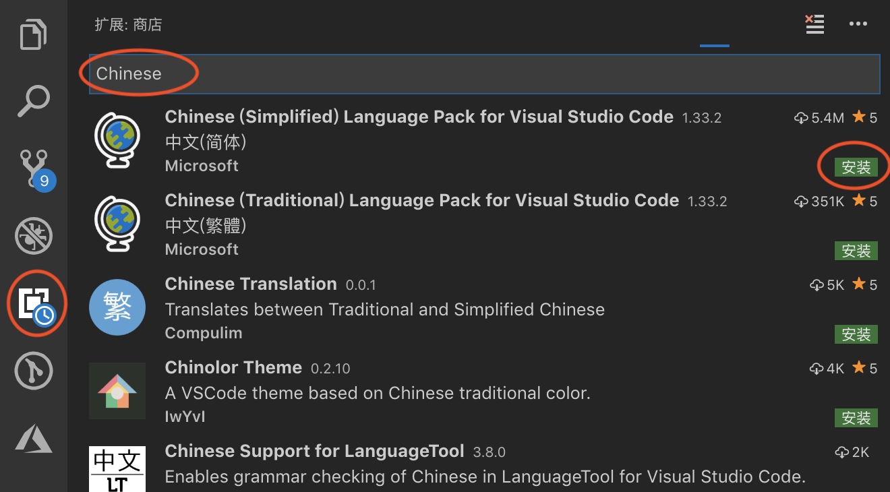
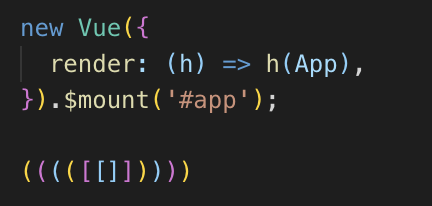

# 03 VSCode揭秘和搭建开发环境

更新时间：2019-07-05 15:24:20


 

宝剑锋从磨砺出，梅花香自苦寒来。

——佚名

这节课我们要做的就是在砍柴之前先磨刀，学习如何借助VSCode愉快高效地开发TypeScript项目，我们来一步一步让VSCode对TypeScript的支持更强大。如果你已经习惯了使用别的编辑器，那你也可以自行搜索下，本节课提到的内容在你使用的编辑器是否有对应的替代品。

### 1.3.1 安装和基本配置

如果你还没有使用过VSCode，当然先要去[官网](https://code.visualstudio.com/)下载了，下载安装我就不多说了，安装好之后，我们先来配置几个基本的插件。

#### （1）汉化

如果你英语不是很好，配置中文版界面是很有必要的，安装个插件就可以了。打开VSCode之后在编辑器左侧找到这个拓展按钮，点击，然后在搜索框内搜索关键字"Chinese"，这里图中第一个插件就是。直接点击install安装，安装完成后重启VSCode即可。


#### （2）编辑器配置

有一些编辑器相关配置，需要在项目根目录下创建一个`.vscode`文件夹，然后在这个文件夹创建一个`settings.json`文件，编辑器的配置都放在这里，并且你还需要安装一个插件[EditorConfig for VS Code](https://marketplace.visualstudio.com/items?itemName=EditorConfig.EditorConfig)这样配置才会生效。配置文件里我们来看几个简单而且使用的配置：

```json
{
    "tslint.configFile": "./tslint.json",
    "tslint.autoFixOnSave": true,
    "editor.formatOnSave": true
}
```

`tslint.configFile`用来指定tslint.json文件的路径，注意这里是相对根目录的；

`tslint.autoFixOnSave`设置为true则每次保存的时候编辑器会自动根据我们的tslint配置对不符合规范的代码进行自动修改；

`tslint.formatOnSave`设为true则编辑器会对格式在保存的时候进行整理。

#### （3）TypeScript相关插件

[TSLint(deprecated)](https://marketplace.visualstudio.com/items?itemName=eg2.tslint)是一个通过tslint.json配置在你写TypeScript代码时，对你的代码风格进行检查和提示的插件。关于TSLint的配置，我们会在后面讲解如何配置，它的错误提示效果在我们之前的例子已经展示过了。

[TSLint Vue](https://marketplace.visualstudio.com/items?itemName=prograhammer.tslint-vue)加强了对Vue中的TypeScript语法语句进行检查的能力。如果你使用TypeScript开发Vue项目，而且要使用TSLint对代码质量进行把控，那你应该需要这个插件。

#### （4）框架相关

如果你使用Vue进行项目开发，那Vue相关的插件也是需要的，比如[Vue 2 Snippets](https://marketplace.visualstudio.com/items?itemName=hollowtree.vue-snippets)。

[Vetur](https://marketplace.visualstudio.com/items?itemName=octref.vetur)插件是Vue的开发辅助工具，安装它之后会得到代码高亮、输入辅助等功能。

#### （5）提升开发体验

[Auto Close Tag](https://marketplace.visualstudio.com/items?itemName=formulahendry.auto-close-tag)插件会自动帮你补充HTML闭合标签，比如你输完``的后面的尖括号后，插件会自动帮你补充``；

[Auto Rename Tag](https://marketplace.visualstudio.com/items?itemName=formulahendry.auto-rename-tag)插件会在你修改HTML标签名的时候，自动帮你把它对应的闭标签同时修改掉；

[Bracket Pair Colorizer](https://marketplace.visualstudio.com/items?itemName=CoenraadS.bracket-pair-colorizer)插件会将你的括号一对一对地用颜色进行区分，这样你就不会被多层嵌套的括号搞晕了，来看看它的样子：



[Guides](https://marketplace.visualstudio.com/items?itemName=spywhere.guides)插件能够帮你在代码缩进的地方用竖线展示出索引对应的位置，而且点击代码，它还会将统一代码块范围的代码用统一颜色竖线标出，如图：


### 1.3.2 常用功能

#### （1）终端

在VSCode中有终端窗口，点击菜单栏的【查看】-【终端】，也可以使用快捷键 ”control+`“ 打开。这样可以直接在编辑器运行启动命令，启动项目，边写代码边看报错。

#### （2）用户代码片段

一些经常用到的重复的代码片段，可以使用`用户代码片段`配置，这样每次要输入这段代码就不用一行一行敲了，直接输入几个标示性字符即可。在VSCode左下角有个设置按钮，点击之后选择【用户代码片段】，在弹出的下拉列表中可以选择【新建全局代码片段文件】，这样创建的代码片段是任何项目都可用的；可以选择【新建"项目名"文件夹的代码片段文件】，这样创建的代码片段只在当前项目可用。创建代码片段文件后它是一个类似于json的文件，文件有这样一个示例：

```javascript
{
    // Place your global snippets here. Each snippet is defined under a snippet name and has a scope, prefix, body and 
    // description. Add comma separated ids of the languages where the snippet is applicable in the scope field. If scope 
    // is left empty or omitted, the snippet gets applied to all languages. The prefix is what is 
    // used to trigger the snippet and the body will be expanded and inserted. Possible variables are: 
    // $1, $2 for tab stops, $0 for the final cursor position, and ${1:label}, ${2:another} for placeholders. 
    // Placeholders with the same ids are connected.
    // Example:
    // "Print to console": {
    // 	"scope": "javascript,typescript",
    // 	"prefix": "log",
    // 	"body": [
    // 		"console.log('$1');",
    // 		"$2"
    // 	],
    // 	"description": "Log output to console"
    // }
}
```

我们来看一下其中的几个关键参数：

- `Print to console`是要显示的提示文字
- `scope`是代码片段作用的语言类型
- `prefix`是你输入这个名字之后，就会出现这个代码片段的选项回车即可选中插入
- `body`就是你的代码片段实体
- `$1`是输入这个片段后光标放置的位置，这个$1不是内容，而是一个占位
- `description`是描述。如果你要输入的就是字符串`lt;$`

好了，暂时VSCode的相关介绍就是这么多，剩下的一些配置tslint等工作，我们会在搭建开发环境和后面的开发中讲到。

## 1.3.3 搭建开发环境

接下来我们开始从零搭建一个开发环境，也就是一个基础前端项目。后面课程中讲到的语法知识，你都可以在这个项目中去尝试，接下来我们就一步一步来搭建我们的开发环境啦。

在开始之前，你要确定你的电脑有node的环境，如果你没有安装过node，先去[Node.js下载地址](https://nodejs.org/en/download/)下载对应你系统的node.js安装包，下载下来进行安装。我在专栏中使用的是v10.15.3版本，你可以尝试最新稳定版本。如果发现启动项目遇到问题，可能是一些安装的依赖不兼容新版本，那你可以安装和我一样的版本。

node安装好之后，可以在命令行运行`node -v`来查看node的版本号。如果正确打印出版本号说明安装成功。npm是node自带的包管理工具，会在安装node的时候自动进行安装，可以使用`npm -v`来查看npm的版本，检验是否安装成功。我们会使用npm来安装我们所需要的模块和依赖，如果你想全局安装一个tslint模块，可以这样进行安装：

```shell
npm install -g tslint
```

如果这个模块要作为项目依赖安装，去掉-g参数即可。更多关于node的知识，你可以参考[node官方文档](https://nodejs.org/dist/latest-v10.x/docs/api/)或[node中文文档](http://nodejs.cn/api/)，更多关于npm的使用方法，可以参考[npm官方文档](https://docs.npmjs.com/)或[npm中文文档](https://www.npmjs.com.cn/)。

#### （1）初始化项目

新建一个文件夹“client-side”，作为项目根目录，进入这个文件夹：

```shell
mkdir client-side
cd client-side
```

我们先使用 npm 初始化这个项目：

```shell
# 使用npm默认package.json配置
npm init -y
# 或者使用交互式自行配置，遇到选项如果直接敲回车即使用括号内的值
npm init
package name: (client-side) # 可敲回车即使用client-side这个名字，也可输入其他项目名
version: (1.0.0) # 版本号，默认1.0.0
description: # 项目描述，默认为空
entry point: (index.js) # 入口文件，我们这里改为./src/index.ts
test command: # 测试指令，默认为空
git repository: # git仓库地址，默认为空
keywords: # 项目关键词，多个关键词用逗号隔开，我们这里写typescript,client,lison
author: # 项目作者，这里写lison<lison16new@163.com>
license: (ISC) # 项目使用的协议，默认是ISC，我这里使用MIT协议
# 最后会列出所有配置的项以及值，如果没问题，敲回车即可。
```

这时我们看到了在根目录下已经创建了一个 package.json 文件，接下来我们创建几个文件夹：

- src：用来存放项目的开发资源，在 src 下创建如下文件夹：
  - utils：和业务相关的可复用方法
  - tools：和业务无关的纯工具函数
  - assets：图片字体等静态资源
  - api：可复用的接口请求方法
  - config：配置文件
- typings：模块声明文件
- build：webpack 构建配置

接下来我们在全局安装`typescript`，全局安装后，你就可以在任意文件夹使用tsc命令：

```shell
npm install typescript -g
```

> 如果全局安装失败，多数都是权限问题，要以管理员权限运行。

安装成功后我们进入项目根目录，使用typescript进行初始化：

```shell
tsc --init
```

> 注意：运行的指令是tsc，不是typescript。

这时你会发现在项目根目录多了一个 tsconfig.json 文件，里面有很多内容。而且你可能会奇怪，json 文件里怎么可以使用`//`和`/**/`注释，这个是 TS 在 1.8 版本支持的，我们后面课程讲重要更新的时候会讲到。

tsconfig.json 里默认有 4 项没有注释的配置，有一个需要提前讲下，就是"lib"这个配置项，他是一个数组，他用来配置需要引入的声明库文件，我们后面会用到ES6语法，和DOM相关内容，所以我们需要引入两个声明库文件，需要在这个数组中添加"es6"和"dom"，也就是修改数组为`[“dom”, “es6”]`，其他暂时不用修改，接着往下进行。

然后我们还需要在项目里安装一下typescript，因为我们要搭配使用webpack进行编译和本地开发，不是使用tsc指令，所以要在项目安装一下：

```shell
npm install typescript
```

#### （2）配置TSLint

接下来我们接入TSLint，如果你对代码的风格统一有要求，就需要用到TSLint了，另外TSLint会给你在很多地方起到提示作用，所以还是建议加入的。接下来我们来接入它。

首先需要在全局安装TSLint，记着要用管理员身份运行：

```shell
npm install tslint -g
```

然后在我们的项目根目录下，使用TSLint初始化我们的配置文件：

```shell
tslint -i
```

运行结束之后，你会发现项目根目录下多了一个`tslint.json`文件，这个就是TSLint的配置文件了，它会根据这个文件对我们的代码进行检查，生成的tslint.json文件有下面几个字段：

```json
{
  "defaultSeverity": "error",
  "extends": [
    "tslint:recommended"
  ],
  "jsRules": {},
  "rules": {},
  "rulesDirectory": []
}
```

- *defaultSeverity*是提醒级别，如果为error则会报错，如果为warning则会警告，如果设为off则关闭，那TSLint就关闭了；
- *extends*可指定继承指定的预设配置规则；
- *jsRules*用来配置对`.js`和`.jsx`文件的校验，配置规则的方法和下面的rules一样；
- *rules*是重点了，我们要让TSLint根据怎样的规则来检查代码，都是在这个里面配置，比如当我们不允许代码中使用`eval`方法时，就要在这里配置`"no-eval": true`；
- *rulesDirectory*可以指定规则配置文件，这里指定相对路径。

以上就是我们初始化的时候TSLint生成的tslint.json文件初始字段，如果你发现你生成的文件和这里看到的不一样，可能是TSLint版本升级导致的，你可以参照[TSLint配置说明](https://palantir.github.io/tslint/usage/configuration/)了解他们的用途。如果你想要查看某条规则的配置及详情，可以参照[TSLint规则说明](https://palantir.github.io/tslint/rules/)。

#### （3）配置webpack

接下来我们要搭配使用 webpack 进行项目的开发和打包，先来安装 webpack、webpack-cli 和 webpack-dev-server：

```shell
npm install webpack webpack-cli webpack-dev-server -D
```

我们将它们安装在项目中，并且作为开发依赖(-D)安装。接下来添加一个 webpack 配置文件，放在 build 文件夹下，我们给这个文件起名 webpack.config.js，然后在 package.json 里指定启动命令：

```json
{
  "scripts": {
    "start": "cross-env NODE_ENV=development webpack-dev-server --mode=development --config build/webpack.config.js"
  }
}
```

这里我们用到一个插件"cross-env"，并且后面跟着一个参数 NODE_ENV=development，这个用来在 webpack.config.js 里通过 process.env.NODE_ENV 来获取当前是开发还是生产环境，这个插件要安装：

```shell
npm install cross-env
```

紧接着我们要在 webpack.config.js 中书写配置：

```js
const HtmlWebpackPlugin = require("html-webpack-plugin");
const { CleanWebpackPlugin } = require("clean-webpack-plugin");

module.exports = {
  // 指定入口文件
  // 这里我们在src文件夹下创建一个index.ts
  entry: "./src/index.ts",
  // 指定输出文件名
  output: {
    filename: "main.js"
  },
  resolve: {
    // 自动解析一下拓展，当我们要引入src/index.ts的时候，只需要写src/index即可
    // 后面我们讲TS模块解析的时候，写src也可以
    extensions: [".tsx", ".ts", ".js"]
  },
  module: {
    // 配置以.ts/.tsx结尾的文件都用ts-loader解析
    // 这里我们用到ts-loader，所以要安装一下
    // npm install ts-loader -D
    rules: [
      {
        test: /\.tsx?$/,
        use: "ts-loader",
        exclude: /node_modules/
      }
    ]
  },
  // 指定编译后是否生成source-map，这里判断如果是生产打包环境则不生产source-map
  devtool: process.env.NODE_ENV === "production" ? false : "inline-source-map",
  // 这里使用webpack-dev-server，进行本地开发调试
  devServer: {
    contentBase: "./dist",
    stats: "errors-only",
    compress: false,
    host: "localhost",
    port: 8089
  },
  // 这里用到两个插件，所以首先我们要记着安装
  // npm install html-webpack-plugin clean-webpack-plugin -D
  plugins: [
    // 这里在编译之前先删除dist文件夹
    new CleanWebpackPlugin({
      cleanOnceBeforeBuildPatterns: ["./dist"]
    }),
    // 这里我们指定编译需要用模板，模板文件是./src/template/index.html，所以接下来我们要创建一个index.html文件
    new HtmlWebpackPlugin({
      template: "./src/template/index.html"
    })
  ]
};
```

这里我们用到了两个webpack插件，第一个`clean-webpack-plugin`插件用于删除某个文件夹，我们编译项目的时候需要重新清掉上次打包生成的dist文件夹，然后进行重新编译，所以需要用到这个插件将上次打包的dist文件夹清掉。
第二个`html-webpack-plugin`插件用于指定编译的模板，这里我们指定模板为`"./src/template/index.html"`文件，打包时会根据此html文件生成页面入口文件。

接下来我们创建这个 index.html 模板：

```html
<!DOCTYPE html>
<html lang="en">
  <head>
    <meta charset="UTF-8" />
    <meta name="viewport" content="width=device-width, initial-scale=1.0" />
    <meta http-equiv="X-UA-Compatible" content="ie=edge" />
    <title>TS-Learning</title>
  </head>

  <body></body>
</html>
```

现在我们运行如下命令来启动本地服务：

```shell
npm run start
```

我们看到启动成功了，接下来我们在 index.ts 文件里写一点逻辑：

```ts
// index.ts
let a: number = 123;

const h1 = document.createElement("h1");
h1.innerHTML = "Hello, I am Lison";
document.body.appendChild(h1);
```

当我们保存代码的时候，开发服务器重新编译了代码，并且我们的浏览器也更新了。

我们再来配置一下打包命令，在 package.json 的 scripts 里增加 build 指令：

```json
{
  "scripts": {
    "test": "echo \"Error: no test specified\" && exit 1",
    "start": "cross-env NODE_ENV=development webpack-dev-server --mode=development --config ./build/webpack.config.js",
    "build": "cross-env NODE_ENV=production webpack --mode=production --config ./build/webpack.config.js"
  }
}
```

同样通过`cross-env NODE_ENV=production`传入参数。现在我们运行如下命令即可执行打包：

```shell
npm run build
```

现在我们前端项目的搭建就大功告成了，我们后面的课程都会在这个基础上进行示例的演示。大家最好都自己操作一遍，把开发环境的搭建流程走一下，如果中间遇到了报错仔细看一下报错信息。下节课开始我们就正式的步入TypeScript的学习中了，我们下节课见。
