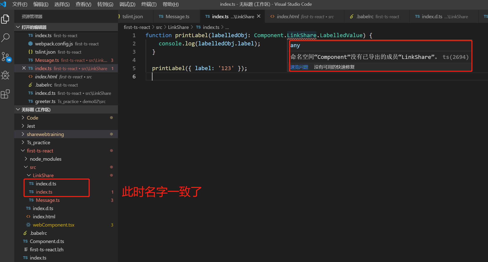
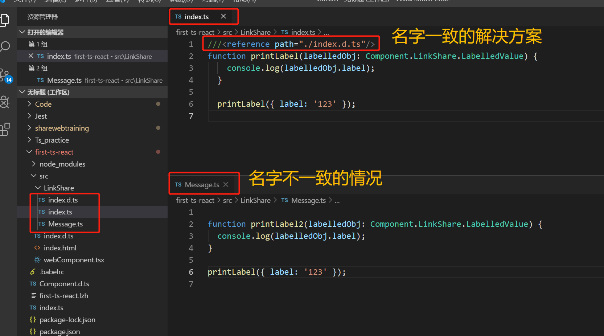

# index.d.ts详解

| 作者   | 日期       |
| ------ | ---------- |
| 小杨 | 2019.10.24 |

[TOC]

## 一、工作任务完成情况

### 工作任务

尝试模拟实现隐藏外链邮件发送区域。

在做得过程中出现的问题：对index.d.ts文件不是很理解，然后还有index.d.ts文件里面的React.StatelessComponent不是很熟悉，不知道具体的作用。

### 学习任务

- index.d.ts文件
- React.StatelessComponent

## 二、学习心得

### index.d.ts文件

为了描述不是用TypeScript编写的类库的类型，我们需要声明类库导出的API。 由于大部分程序库只提供少数的顶级对象，命名空间是用来表示它们的一个好办法。

我们称其为声明是因为它不是外部程序的具体实现。 通常在 `.d.ts`文件里写这些声明。

通俗的来讲：是将声明语句放到一个单独的文件，这个文件就是以 `.d.ts`结尾的文件。

举例子：

目录层级结构：

```ts
/project

├── src

|  ├── index.ts

|  └── index.d.ts

|  └── index.tsx

└── tsconfig.json
```

`index.d.ts`

```ts
declare namespace Component {
  namespace Config {
    interface LabelledValue {
      label: string;
    }
  }
}
```

`index.ts`

```ts
function printLabel(labelledObj: Component.Config.LabelledValue) {
  console.log(labelledObj.label);
}

printLabel({ label: '123' });
```

当以上面的目录结构进行配置时，`index.d.ts`在src目录下不能够被识别，在`index.ts`中就会报一个提示错误：“找不到命名空间”。这时候需要在 `tsconfig.json` 中的 `files`、`include` 和 `exclude` 配置，确保其包含了` .d.ts`结尾的文件。

`tsconfig.json`

```js
{
  "include": [
    "*/**/.**.d.ts"
  ]
}
```

还有一种是直接将该`index.d.ts`放在根目录下，这时候是会被识别出来的。


遇到的坑：为什么在AnyShare项目中可以不用在`tsconfig.json`中做 `files`、`include` 和 `exclude` 的配置？

昨天一直在思考一个问题，为什么AnyShare项目里不用在`tsconfig.json`中做 `files`、`include` 配置，就可以使`index.d.ts`文件有效？



然后发现是在同级目录下存在`index.ts`文件时，你这时就不需要`index.d.ts`文件，也就是说这时候`index.ts`会导致`index.d.ts`文件不能识别出来。这时候在同级目录下就不能再用相同的前缀名了。

**总结出一句话**：`.d.ts`文件如果和`.ts`或`.tsx`文件存在相同的前缀名称，那么`.ts`或者`.tsx`文件就会导致`.d.ts`文件不能被识别，会报一个“找不到命名空间的错误”，所以为了避免这种问题的出现的话，我们应该避免它们之间的前缀名相同。

如果我非要给`.ts`或者`.tsx`文件取一个与`.d.ts`文件一样的名字，那么如何解决呢?

1. 就是在`tsconfig.json`中做 `files`、`include` 配置。

2. 可以通过使用`///<reference path=""> `语法来解决：

   ```ts
   ///<reference path="./Message.d.ts"/>
   function printLabel(labelledObj: Component.LinkShare.LabelledValue) {
     console.log(labelledObj.label);
   }
   
   printLabel({ label: '123' });
   ```

结果如下：



### `///<reference path=""> ` 是什么？

`///<reference path=""> ` 它是一种注释，告诉typescript编译器，当前文件使用了哪些声明文件，以帮助编辑器提示信息，及编译器检查类型。这种注释很重要，如果后面的路径不对，则编译会失败。 


然后再后面我还遇到一个问题，在ts文件和.d.ts文件不同前缀名的情况下，通过`tsc`编译`ts`文件，编译不通过，报了一个`Cannot find namespace 'Component'`的错？

解决方式是在`.ts`使用`///<reference path=""/> `来解决了编译不通过的问题。


此外还需要注意的点是:

 **在d.ts文件里面，在最外层声明变量或者函数或者类要在前面加上这个关键字（declare）。在typescript的规则里面，如果一个`.ts`、`.d.ts`文件如果没有用到import或者export语法的话，那么最顶层声明的变量就是全局变量。** 


### 参考资料

- [reference---TS官网]( https://www.tslang.cn/docs/handbook/namespaces.html )

- [index.d.ts与index.ts]( https://stackoverflow.com/questions/51516394/what-is-the-main-usage-of-index-d-ts-in-typescript/51517448 )

  

### React.StatelessComponent

它其实是TypeScript在react中声明的一个无状态函数组件。

如何声明使用无状态函数组件？

`index.tsx`

```tsx
import * as React from 'react';
interface CardProps {
}
//第一种
export const ExampleA: React.SFC<CardProps> = (props) => {
  return (
      <div />
  )
}
//第二种
export const ExampleB: React.StatelessComponent<CardProps> = (props) => {
  return (
      <div />
  )
}
```

在React 16.8版本，hooks的介绍里面遗弃了这两种类型的声明方式。函数组件不再只是关注于无状态。

hooks它可以让你在不编写 class 的情况下使用 state 以及其他的 React 特性。 

最新的React又提供了两种定义的方式：

```tsx
export const ExampleC: React.FC<CardProps> = (props) => {
  return (
      <div />
  )
}

export const ExampleD: React.FunctionComponent<CardProps> = (props) => {
  return (
      <div />
  )
}
```

为了不破坏代码现有的代码，SFC和  StatelessComponents是React.FunctionComponent的别名，不过会出现一个不推荐使用的警告信息。

 

通过使用这种无状态函数组件可以 使得你对组件的测试进行了分离，还提升了通用组件的性能（  Not only does this allow you to test your components separately, but it also increases the usability of common component types. ）。


## 三、参考资料

- [声明文件——非常重要]( https://ts.xcatliu.com/basics/declaration-files )
- [index.d.ts解读]( https://segmentfault.com/a/1190000009247663#articleHeader12 )
-  [Stateless Functional Components](https://www.pluralsight.com/guides/typescript-building-react-components) 